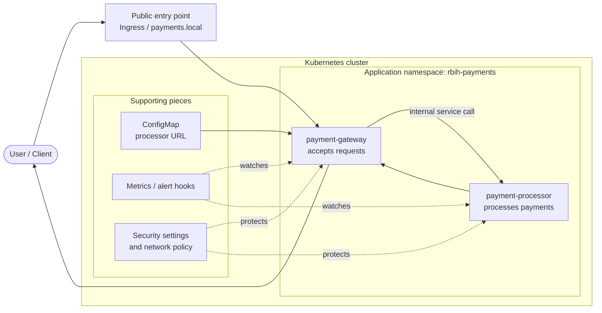

# RBIH DevOps Assignment

This repo has my solution for the RBIH DevOps take-home.

The main goal was to get the two given services running properly on a local Kubernetes setup and then add a few things that I think are important before handing something like this to another engineer. I tried to keep it practical and easy to review instead of turning it into a very large setup.

The assignment mentions security, operability, reliability, and general engineering quality, so those were the main things I kept in mind while putting this together. It also says not to over-engineer, so I tried to stay on the simple side and call out the things I would add next if this was taken further. [file:1]

## What is in the repo

- `README.md` - overview, architecture, run steps, and notes
- `k8s/base` - main Kubernetes manifests
- `k8s/overlays/dev` - local overlay
- `scripts` - helper scripts to create the cluster and do a quick check
- `docs` - extra notes and architecture write-up
- `charts/rbih-payments` - Helm chart version of the same setup
- `.github/workflows` - basic CI checks

## Services

The assignment gives two container images:

- `payment-gateway`
- `payment-processor`

`payment-gateway` accepts incoming payment requests and forwards them to `payment-processor`. The PDF also says the gateway reaches the processor through an environment variable and that both services expose health and Prometheus-compatible metrics endpoints. [file:1]

## Approach

I started with plain Kubernetes manifests because I think they are the easiest thing to review in a take-home like this. After that, I kept them under a simple Kustomize structure so the base stays readable and a local overlay can sit on top of it.

I also added a Helm chart version. That is not strictly necessary for this assignment, but I thought it was useful to show how I would package the same setup if it had to be reused more cleanly later.

## Architecture diagram



Simple flow: traffic comes to the gateway first, and then the gateway talks to the processor inside the cluster. The other pieces around it are there mainly for config, monitoring, and basic hardening.

## Why I added these things

### Health checks

I added startup, readiness, and liveness probes so Kubernetes can tell whether a pod is starting, ready to receive traffic, or stuck.

### Resource requests and limits

I did not want the containers to run fully unconstrained, so I added basic requests and limits.

### NetworkPolicy and security context

Since this is payment-related traffic, I wanted at least a basic security baseline in place. So I kept the processor internal, added network restrictions, used dedicated service accounts, and set the containers to run with more restricted settings.

### Monitoring hooks

Because the services already expose Prometheus-style metrics according to the assignment, I added `ServiceMonitor` and `PrometheusRule` examples so there is at least a starting point for monitoring and alerting. [file:1]

## Running it

### You need

- Docker
- `kubectl`
- `kind`
- `helm` if you want to use the Helm chart

### Kustomize path

```bash
./scripts/bootstrap-kind.sh
kubectl apply -k k8s/overlays/dev
```

### Helm path

```bash
helm upgrade --install rbih-payments ./charts/rbih-payments --create-namespace --namespace rbih-payments
```

## Quick validation

```bash
kubectl -n rbih-payments get pods
kubectl -n rbih-payments get svc
kubectl -n rbih-payments get ingress
./scripts/smoke-test.sh
```

## Notes on the repo structure

I tried to keep things separated by purpose so it is easier to review:

- manifests in `k8s`
- scripts in `scripts`
- extra docs in `docs`
- optional packaging in `charts`
- CI in `.github/workflows`

That felt like the cleanest structure for something that should be easy to hand over and easy to reproduce on a normal machine. The assignment explicitly calls out clarity and useful documentation, so I wanted the repo layout to reflect that. [file:1]

## If something breaks

The first things I would check are:

- pod status
- deployment rollout status
- logs from gateway and processor
- service endpoints
- whether the gateway can still reach the processor

That is also why I added probes, smoke test scripts, and monitoring examples. The assignment asks how an on-call engineer would know what happened at 3 AM, so I wanted the repo to make those first checks straightforward. [file:1]

## Trade-offs / what I did not fully add

This was a time-boxed exercise, so I did not try to build every production feature around it.

If I had more time, the next things I would look at are:

- mTLS or stronger service-to-service security
- proper secret management
- centralized logs and dashboards
- stronger CI validation
- image scanning and signing
- more complete alerting

The assignment says it is fine to mention what was skipped due to time, so I think it is better to call these out clearly instead of pretending everything is fully production-complete. [file:1]
