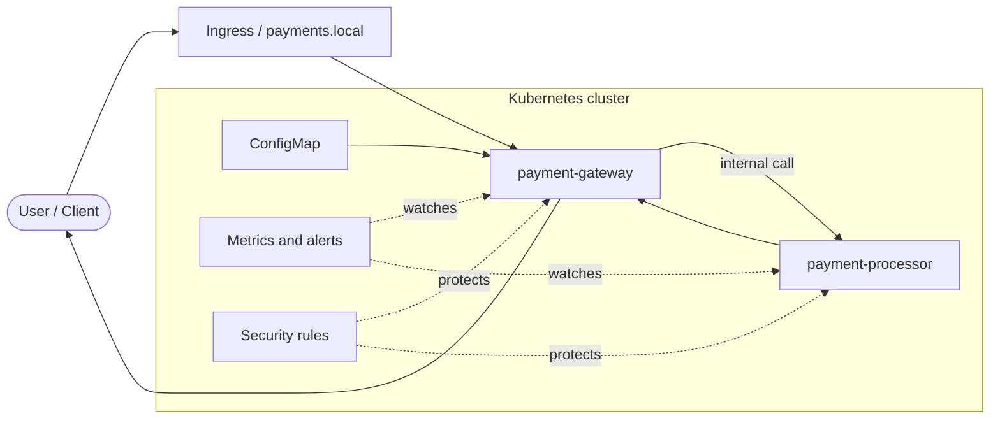

# RBIH DevOps Assignment

This repo contains my solution for the RBIH DevOps take-home.

I used a local Kubernetes setup and deployed the two given services there. After getting the basic flow working, I added a few things I would normally want before handing it over to someone else, like health checks, resource limits, basic network restrictions, monitoring hooks, and a cleaner repo structure.

I tried not to overdo it because the assignment is time-boxed and also says not to over-engineer. So I focused more on keeping the setup understandable and reproducible than on adding every possible production feature. [file:1]

## What is in the repo

- `README.md` - overview, run steps, architecture, and notes
- `k8s/base` - main Kubernetes manifests
- `k8s/overlays/dev` - local overlay
- `scripts` - helper scripts for cluster setup and quick checks
- `docs` - extra notes and architecture doc
- `charts/rbih-payments` - Helm version of the setup
- `.github/workflows` - CI checks

## Services

The assignment gives two services:

- `payment-gateway`
- `payment-processor`

The gateway accepts requests and forwards them to the processor. The PDF also says the gateway reaches the processor using an environment variable, and both services expose health and Prometheus-compatible metrics endpoints. [file:1]

## Approach

I started with plain Kubernetes YAML because it is easier to review in a take-home assignment. Then I kept it under a simple Kustomize structure so the base manifests stay separate from the local overlay.

I also added a Helm chart version. That part is optional, but I thought it was useful to show how the same setup could be packaged in a cleaner way if it needed to be reused later.

## Architecture



The main path is simple: traffic comes to the gateway first, and then the gateway talks to the processor inside the cluster. The rest of the pieces are there to support config, health, monitoring, and basic hardening.

## Why these pieces are there

### Health checks

I added startup, readiness, and liveness probes so Kubernetes can tell whether a pod is still starting, ready for traffic, or stuck.

### Requests and limits

I added basic CPU and memory requests/limits so the pods are not running completely open-ended.

### Network policy and security settings

I kept the processor internal and added some basic restrictions around traffic and container settings. Since this is payment-related traffic, I wanted at least a basic security baseline in place. The assignment also makes it clear that security matters here. [file:1]

### Monitoring hooks

Since both services already expose Prometheus-style metrics, I added `ServiceMonitor` and `PrometheusRule` examples so there is a starting point for monitoring and alerting. [file:1]

## How to run it

### Prerequisites

You need:

- Docker
- `kubectl`
- `kind`
- `helm` if you want to use the Helm chart

### Run with Kustomize

```bash
./scripts/bootstrap-kind.sh
kubectl apply -k k8s/overlays/dev
```

### Run with Helm

```bash
helm upgrade --install rbih-payments ./charts/rbih-payments --create-namespace --namespace rbih-payments
```

## Quick checks

```bash
kubectl -n rbih-payments get pods
kubectl -n rbih-payments get svc
kubectl -n rbih-payments get ingress
./scripts/smoke-test.sh
```

## If something breaks

The first things I would check are:

- pod status
- rollout status
- gateway logs
- processor logs
- service endpoints
- whether gateway can still reach processor

That is also why I added probes, smoke checks, and monitoring examples. The assignment asks how an on-call engineer would understand what happened if something failed, so I wanted those checks to be straightforward. [file:1]

## Trade-offs

I did not try to add everything that might exist in a full production setup.

If I had more time, the next things I would look at are:

- stronger service-to-service security like mTLS
- proper secret management
- better dashboards and alerts
- centralized logging
- image scanning in CI

The assignment explicitly says it is fine to call out things that were skipped because of time, so I think it is better to mention them clearly here. [file:1]
