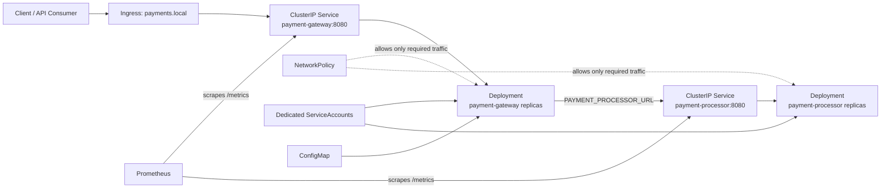

# Architecture Diagram

## Flow

1. Client traffic enters through local ingress or port-forward to `payment-gateway`.
2. The gateway forwards payment requests to `payment-processor` using internal Kubernetes service discovery.
3. Both services expose health and Prometheus metrics endpoints.
4. Prometheus scrapes metrics for dashboards and alerting.
5. Network policies and hardened pod security settings reduce exposure and limit blast radius.
